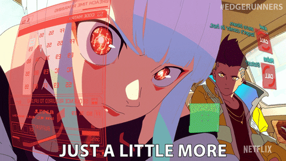

<div align="center">



<br/>


</div>

<details open>
<summary><code>⟩ SYSTEM BOOT SEQUENCE — INITIALIZING NODE...</code></summary>

<div align="center">

<br/>

```text
╔══════════════════════════════════════════════════════════════════════╗
║  NECROTECH HYDRA v2.1  ·  PERSONAL NODE ACTIVE                     ║
╠══════════════════════════════════════════════════════════════════════╣
║  OPERATOR  ▸  MCPE4CE              CLASS   ▸  ROOKIE NETRUNNER     ║
║  STATUS    ▸  ONLINE / BUILDING    FOCUS   ▸  C · PYTHON · JS · AI ║
║  THREAT    ▸  NONE DETECTED        UPTIME  ▸  COMMITTING DAILY     ║
╚══════════════════════════════════════════════════════════════════════╝
```

<br/>


<br/>

<a href="https://elodie-tisserand-soprano.fr/">
  
</a>

<br/><br/>


</div>

</details>

<p align="center"><code>░▒▓████████████████████████████████████████████████████████████████▓▒░</code></p>

## `⟩⟩ BRAINDANCE LOG // ABOUT ME`


> [!CAUTION]
> _"Everyone has a plan 'til they get punched in the face by a pointer."_

I'm a **beginner developer** building strong foundations before scaling up.
Right now I'm focused on <kbd>C</kbd>, <kbd>Python</kbd> and <kbd>JavaScript</kbd> — writing real code, improving through small projects.
Lately I've been shipping web backends with <kbd>Flask</kbd> and building **AI agents** with <kbd>Google ADK</kbd> and <kbd>Ollama</kbd>.

No rushed shortcuts. One concept at a time. Night City wasn't built in one commit.

May the force be with me or something like that x)

<br/>

<p align="center"><code>░▒▓████████████████████████████████████████████████████████████████▓▒░</code></p>

## `⟩⟩ CYBERWARE // CURRENT STACK`

### `[ LANGUAGES ]`

<a href="#"></a>

### `[ FRAMEWORKS & AI ]`

<a href="#"></a>

<p>
  
  
</p>

### `[ TOOLS & ENVIRONMENT ]`

<a href="#"></a>

<br/>

```text
╔══════════════════════════════════════════════════════════════╗
║  AUXILIARY MODULES                                          ║
╠══════════════════════════════════════════════════════════════╣
║  [■] GitHub Desktop   [■] Canva        [■] Valgrind        ║
║  [■] GNU GDB          [■] AI Tools     [■] ComfyUI         ║
║  [■] UML                                                   ║
╚══════════════════════════════════════════════════════════════╝
```

### `[ CERTIFICATIONS ]`

<p>
  
  
  
</p>

<br/>

<p align="center"><code>░▒▓████████████████████████████████████████████████████████████████▓▒░</code></p>

## `⟩⟩ GIGS // ACTIVE OPERATIONS`

<div align="center">

```text
╔══════════════════════════════════════════════════════════════════════╗
║  ★ FLAGSHIP DEPLOY  ·  SIGNAL LIVE ON THE GRID                     ║
╠══════════════════════════════════════════════════════════════════════╣
║  CLIENT  ▸  ÉLODIE TISSERAND · SOPRANO                             ║
║  NODE    ▸  elodie-tisserand-soprano.fr                            ║
║  STATUS  ▸  ONLINE / SHIPPED TO A REAL CLIENT                      ║
╚══════════════════════════════════════════════════════════════════════╝
```

### `[ ▸ WEBSITE FOR A SOPRANO ]`

<a href="https://elodie-tisserand-soprano.fr/">
  
</a>

<br/><br/>


</div>

```text
TYPE    :: Client Portfolio Website  ·  DELIVERED
STACK   :: HTML · CSS · Vanilla JS
HOST    :: OVH · Apache · Custom domain (HTTPS)
EXTRAS  :: Bilingual FR/EN · JSON-driven content · Zero framework, zero build step
```

Bilingual **FR/EN** portfolio built for a French soprano — no framework, no build step, all content
driven from JSON so the artist can update her own bio, repertoire and dates. Designed, built and
deployed end-to-end. **First project shipped to a real client.**

<br/>

<p align="center"><code>─────────────────────────  OTHER OPERATIONS  ─────────────────────────</code></p>

<table>
<tr>
<td width="33%" valign="top">

**`▸ CARDRIFT`**


```text
TYPE    :: Roblox Card Game
STACK   :: Lua · Roblox · Claude
```

</td>
<td width="33%" valign="top">

**`▸ SIMPLE SHELL`**


```text
TYPE    :: System Tool
STACK   :: C
```

Unix shell rebuilt from scratch in C — parsing, forking, builtins.

</td>
<td width="33%" valign="top">

**`▸ NIGHTHUNTER`**


```text
TYPE    :: Dungeon Crawler Game
STACK   :: Python · Flask · SQLite · JWT
```

Dungeon crawler from a single script to a full REST API — auth, persistence, and client.

</td>
</tr>
</table>

<br/>

<p align="center"><code>░▒▓████████████████████████████████████████████████████████████████▓▒░</code></p>

## `⟩⟩ CITY TELEMETRY // LIVE SIGNALS`

<div align="center">

<table><tr>
<td><a href="https://github.com/McPe4ce"></a></td>
<td><a href="https://github.com/McPe4ce"></a></td>
</tr></table>

<a href="https://github.com/McPe4ce?tab=repositories"></a>
<a href="https://github.com/McPe4ce?tab=repositories"></a>

<a href="https://github.com/McPe4ce"></a>

</div>

<p align="center"><code>░▒▓████████████████████████████████████████████████████████████████▓▒░</code></p>

## `⟩⟩ SECURE CHANNELS // NETWORK`

<div align="center">

<a href="https://github.com/McPe4ce">
  
</a>
&nbsp;
<a href="https://x.com/McPeace200">
  
</a>
&nbsp;
<a href="mailto:phil.ghanem@gmail.com">
  
</a>
&nbsp;
<a href="https://discord.com/users/mcpeace_">
  
</a>
&nbsp;
<a href="https://www.linkedin.com/in/philippe-ghanem">
  
</a>

</div>

<br/>

<p align="center"><code>░▒▓████████████████████████████████████████████████████████████████▓▒░</code></p>

<div align="center">

```text
        ╔══════════════════════════════════════════════════════════════════════╗
        ║  > TRANSMISSION ENDED                                              ║
        ║  > JACKING OUT OF THE GRID...                                      ║
        ║  > UPLINK SEVERED. SEE YOU IN NIGHT CITY.                          ║
        ╚══════════════════════════════════════════════════════════════════════╝
```

<br/>



<br/>

<sub><code>[ GRID STATUS: ONLINE ]</code> &nbsp;·&nbsp; <code>[ NODE: MCPE4CE ]</code> &nbsp;·&nbsp; <code>[ UPTIME: ACTIVE ]</code></sub>

</div>


